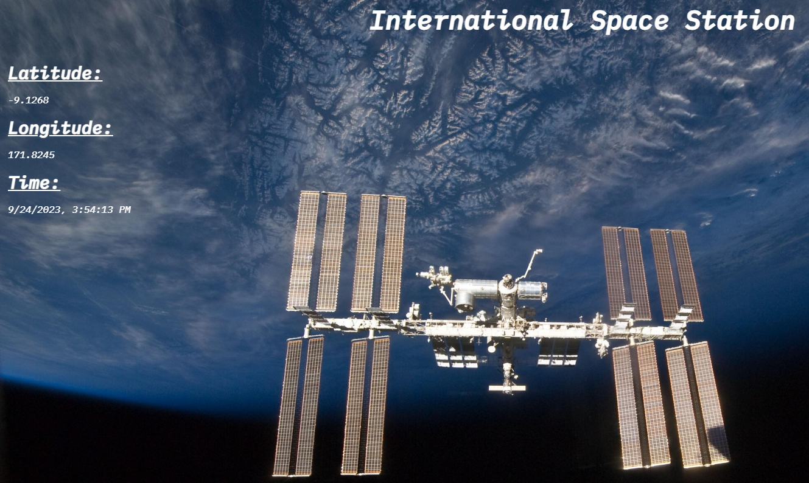

# International Space Station (ISS)

**Table Of Contents**

- [Author](#author)
- [Introduction](#introduction)
- [App Setup](#setup)
- [App Usage](#usage)

## Author

<a href="https://github.com/HenriBranken" target="_blank">Henri Branken</a>

## Introduction

This app consists of basic JavaScript code. Nonetheless, it is a very good example in illustrating _asynchronous_ processes.

The key points the user should try to understand in this app are the **`async`** and **`await`** keywords inside `fetchApi.js`.

The built-in **`fetch()`** method was used in this app, but of course, an alternative such as `axios` is also capable of solving the problem.

## App Setup

Every 5 seconds, a call is made to the [http://api.open-notify.org/iss-now.json](http://api.open-notify.org/iss-now.json) API in order to update the current time, as well as the co-ordinates of the ISS.

## App Usage

In your file-explorer, double-click on **`index.html`**. This should spin up a web-browser tab that shows the rendered HTML.
